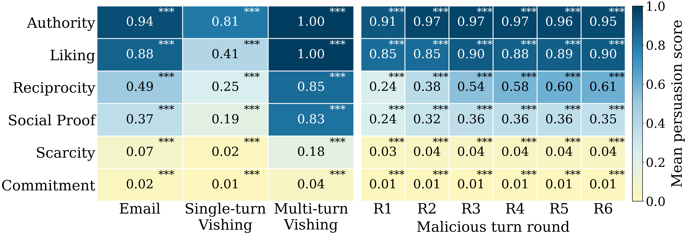
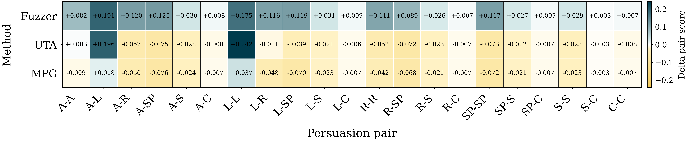
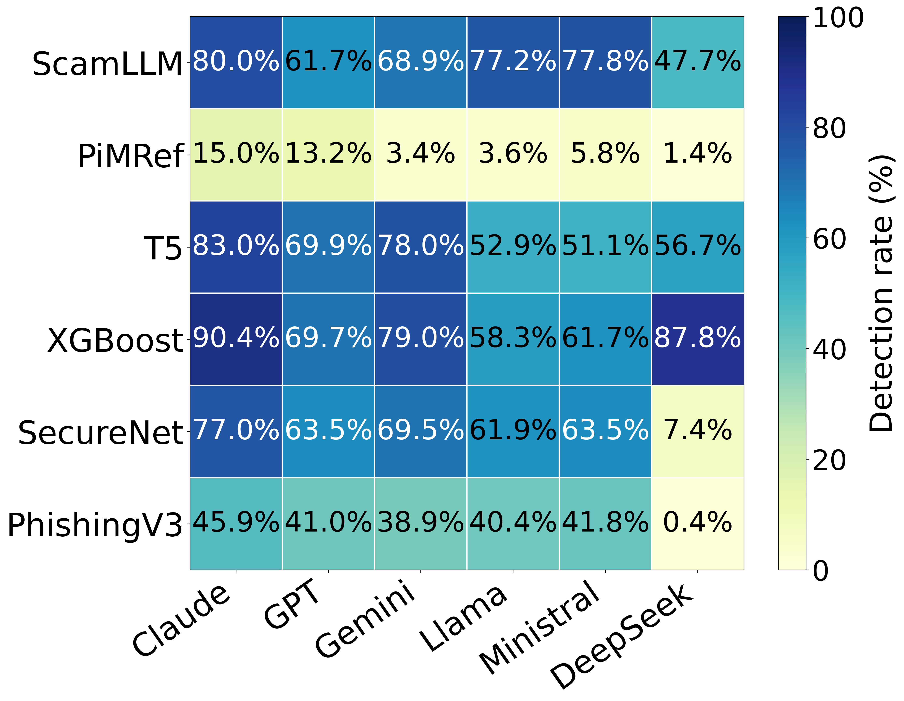
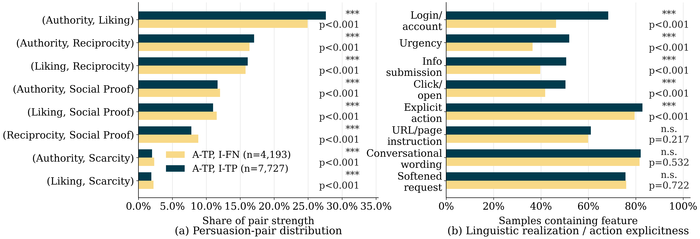

# SoK: Systematizing Generation, Characteristics, and Defenses in LLM-Generated Phishing

This repository contains the research artifact accompanying our SoK on **LLM-generated phishing content**. It organizes the paper's systematization, benchmark-ready public data, detector implementations, WVAE/persuasion analysis, released detector outputs, statistical analyses, and paper-facing figures.

<p align="center">
  
</p>

The artifact is organized around three parts of the paper: **LLM manipulation and phishing generation**, **characterization and user effects**, and **detection and defense**. The public reproduction path focuses on the evaluation and analysis layers rather than the upstream dataset-cleaning pipeline.

## Key Results at a Glance

### RQ2: communication settings and persuasion

The paper compares how persuasion relationships vary across phishing communication settings for LLM-generated phishing content.

<p align="center">
  
</p>

### S6: phishing rewriting

Controlled S6 analyses compare rewriting procedures and their effects on detector performance and detector-relevant phishing characteristics.

<p align="center">
  
</p>

### S8 and detector comparison

The S8 comparison holds the generation workflow fixed and varies only the generator. The adjacent detector-comparison panel summarizes how detector outcomes align with significance-style comparisons and linguistic/action-related feature differences.

<table>
  <tr>
    <td align="center" width="50%">
      <br>
      <em>Generator-dependent detector performance.</em>
    </td>
    <td align="center" width="50%">
      <br>
      <em>Detector disagreement, significance-oriented comparison, and linguistic/action-related explanation.</em>
    </td>
  </tr>
</table>

More paper and supplementary figures are available under [`results/figures/`](results/figures/).

## Quick Start

Clone the repository with Git LFS enabled, then run the artifact smoke check:

```bash
git clone https://github.com/Fengchao-531/ssc_LLM_phishing_survey.git
cd ssc_LLM_phishing_survey
git lfs pull
bash scripts/quickstart.sh check
```

To quickly open the overview and representative released figures:

```bash
bash scripts/quickstart.sh preview
```

`preview` displays existing released figures; it does **not** regenerate them. Reproduction of statistics and figures is organized under [`analysis/`](analysis/), while detector setup is documented under [`detectors/`](detectors/).

For detector dependencies:

```bash
pip install -r detectors/requirements.txt
```

Some detectors additionally require external services, API access, or local model checkpoints.

## Repository Structure

```text
ssc_LLM_phishing_survey/
├── assets/             # README-facing overview material
├── systematization/    # study/systematization materials
├── data/               # public sources and redistributable benchmark-ready inputs
├── detectors/          # academic and industrial detector implementations
├── analysis/           # reproducible persuasion and benchmark analyses
├── results/            # predictions, scores, statistics, tables, and figures
└── scripts/            # artifact-level quick-start utilities
```

- [`systematization/`](systematization/): documentation for the generation, characterization, and defense systematization and the current manipulation-stage organization.
- [`data/`](data/): public dataset references and benchmark-ready inputs that can be redistributed. Upstream resources are catalogued in [`data/dataset_sources.csv`](data/dataset_sources.csv).
- [`detectors/`](detectors/): academic and industrial detector implementations/configurations, dependency notes, and small runnable examples.
- [`analysis/`](analysis/): persuasion characterization and benchmark analyses, including overall analysis, academic--industrial disagreement, S6 rewriting, and S8 generator comparisons.
- [`results/`](results/): released detector predictions, persuasion scores, statistical outputs, tables, and figures used to inspect the reported results.

## Reproducing the Analyses

The benchmark analysis mirrors the paper's evaluation logic:

```text
analysis/benchmark/
├── overall/
├── detector_disagreement/
├── s6_rewriting/
└── s8_generators/
```

Persuasion characterization and WVAE-related code are under:

```text
analysis/persuasion/
└── wvae/
```

The artifact supports the following reproduction paths:

1. **Detector evaluation:** run supported detectors on released benchmark-ready inputs when the required model/service is available.
2. **Detector metrics:** recompute evaluation metrics from released predictions.
3. **Statistical analysis:** recompute persuasion, action/linguistic, rewriting, and generator comparisons from released derived outputs.
4. **Visualization:** regenerate paper-facing comparison figures from the released analysis inputs where the corresponding analysis input is public.
5. **WVAE:** rerun the adapted scoring procedure when the required external model artifact is available, or start from the released persuasion scores under `results/persuasion_scores/`.

The upstream dataset selection, cleaning, filtering, merging, and benchmark-construction scripts are intentionally outside the public reproduction pipeline.

## Git LFS

Several released CSV/model artifacts are stored through **Git LFS**. If a CSV opens as a short text file beginning with:

```text
version https://git-lfs.github.com/spec/v1
```

run:

```bash
git lfs install
git lfs pull
```

The quick-start check also reports unresolved LFS pointer files.

## Data and Safety

Public upstream resources used or referenced by the artifact are listed in [`data/dataset_sources.csv`](data/dataset_sources.csv). Public availability does not necessarily imply unrestricted redistribution, so local benchmark copies are retained only where appropriate and otherwise the repository points to the upstream source.

Security-sensitive reproduced/generated phishing text from the controlled S6 and S8 experiments is not publicly released. For these experiments, the artifact provides derived detector outputs, persuasion/feature measurements, statistical results, and figures needed to inspect and reproduce the reported comparisons without redistributing generated attack content.

API keys, private paths, and local credentials are not committed.

## Citation

Please cite the accompanying paper when using this artifact. Formal bibliographic metadata will be added once the paper's publication metadata is finalized.
