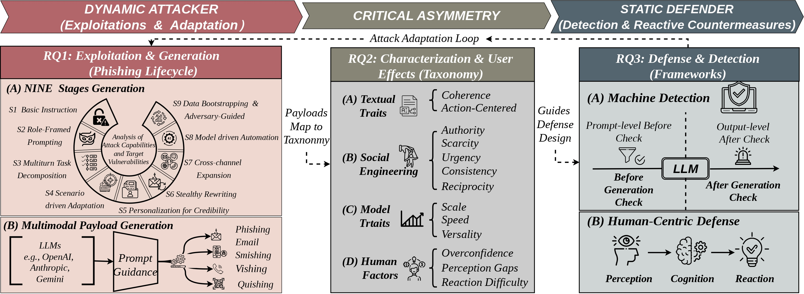

# SoK: Exposing the Generation and Detection Gaps in LLM-Generated Phishing

Phishing campaigns involve adversaries masquerading as trusted vendors trying to trigger user behavior that enables them to exfiltrate private data. While URLs are an important part of phishing campaigns, communicative elements like text and images are central in triggering the required user behavior. Further, due to advances in phishing detection, attackers react by scaling campaigns to larger numbers and diversifying and personalizing content. In addition to established mechanisms, such as template-based generation, large language models (LLMs) can be used for phishing content generation, enabling attacks to scale in minutes, challenging existing phishing detection paradigms through personalized content, stealthy explicit phishing keywords, and dynamic adaptation to diverse attack scenarios.

Countering these dynamically changing attack campaigns requires a comprehensive understanding of the complex LLM-related threat landscape. Existing studies are fragmented and focus on specific areas. In this work, we provide the first holistic examination of LLM-generated phishing content. First, to trace the exploitation pathways of LLMs for phishing content generation, we adopt a modular taxonomy documenting nine stages by which adversaries breach LLM safety guardrails. We then characterize how LLM-generated phishing manifests as threats, revealing that it evades detectors while emphasizing human cognitive manipulation. Third, by taxonomizing defense techniques aligned with generation methods, we expose a critical asymmetry that offensive mechanisms adapt dynamically to attack scenarios, whereas defensive strategies remain static and reactive. Finally, based on a thorough analysis of the existing literature, we highlight insights and gaps and suggest a roadmap for understanding and countering LLM-driven phishing at scale.

## Repository Structure

- `Datasets/`: public dataset references and safe release notes for restricted data.
- `Detectors/`: detector wrappers, public setup notes, and runnable examples.
- `Evaluation/`: aggregate evaluation tables and stage-transfer trend summaries.
- `Visualisation/`: detector response visualisations, the interaction page, and WVAE persuasion-scoring code.
- `Work/`: additional project notes.

## Safety Note

The public release avoids uploading raw phishing emails, full detector row outputs, API keys, or restricted S8 model-output data. The `Visualisation/output/` directory contains README files and PNG figures only; aggregate metrics for the viewer are stored separately in `Visualisation/data/`.
